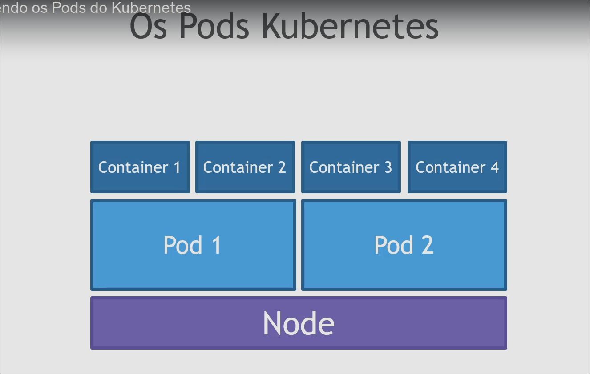

# Kubernetes
 - Kubernetes é utilizado para orquestrar os containeres docker e promover ações importantes como.
   - Auto scaling.
   - Service discovery para ajudar os microsserviços a encontrarem uns aos outros.
   - Load balancer.
   - Self healing para verificar a integridade e substitui instancias com falhas.
   - Zero Downtime deployments.

# Principais comandos:
 - Criar um deployment
  `kubectl create deployment <nome do deployment> --image=<nome da imagem>`
 - Expor um pod
  `kubectl expose pod hello-kubernetes-689bdcfc58-mhv4b --type=LoadBalancer --port=8080`
 - Expor um deployment
  `kubectl expose deployment hello-kubernetes --type=LoadBalancer --port=8080`
 - Adicionar autoscale para um deployment
  `kubectl autoscale deployment <nome do deployment> --max=10 --cpu-persent=70`
 - Escalar um pod
  `kubectl scale deployment <nome do deployment> --replicas=3`
 - Alterar imagem do deployment
  `kubectl set image deployment <nome do deployment> <nome do deployment>=<nome da imagem>:<versão da imagem>`
 - Verificar eventos que aconteceram (ordenado por data)
  `kubectl get events --sort-by=.metadata.creationTimestamp`
  
# Alternativas
 - Diversos provedores de Cloud tem seus próprios serviços de kubernetes em nuvem como o EKS (AWS) GKE (Google Cloud) AKS (Azure).
 - Também temos o docker swarm, mas por conta de sua limitação de escalabilidade e performance, o Kubernetes segue sendo o favorito da comunidade e das empresas.
 
# Kubernetes como Gerenciador
- O kubernetes gerencia seus servidores virtuais.
- Os servidores virtuais são chamados de "nodes" tendo geralmente apenas 1 master node.
- Esse master node é quem gerencia os demais nodes.

# Pods
- Comando para listar os pods é o `kubectl get pods`
- Para visualizar as informações de um pod `kubectl describe pod <pod>`
- Ao desejar criar um container, é necessario armazenalo em um pod, conforme a imagem abaixo<br>
</img>
<br>
- Um pod pode conter um ou mais containers dentro dele.

# Replicasets
 - Replicasets é basicamente o serviço que mantem a quantidade de pods em execução

# Deployments
 - O deployment garante a disponibilidade das aplicações (pods), caso atualizamos a imagem do deployment e essa imagem nao for encontrada, o deployment garante a disponibilidade mantendo os pods com a imagem antiga.
 - Quando a nova imagem é "setada".

# Services
- Os services funcionam como um proxy, onde os pacotes chegam nele e ele passa para os respectivos pods, fazendo o balanceamento de carga usando o algoritmo <i>round-robin</i> por todos os pods existentes.

# Arquitetura do kubernetes
- Há um master node
- Componentes importantes do master node
  - ETCD -> um banco de dados que armazena todas as operações e informações que precisamos como os dados dos pods, numero de pods, as configurações no geral.
  - Kube APIserver -> é uma API que recebe os eventos que o node deve executar como alterações de configurações, escalabilidade de pods, etc...
  - Kube-scheduler -> é o responsável por agendar os pods nos nodes
  - Kube-controller-manager -> ele assegura que o estado desejado de nosso cluster precisa ser executado
- Todas as aplicações são executadas nos pods dentro dos <i>worker nodes</i> ou simplesmente chamados de <i>nodes</i> 
- Componentes presentes nos nodes
  - Agent node ou kubelet -> é responsável por verificar tudo que está acontecendo no node, e comunica o master node, caso o pod caia por exemplo, esse agente avisará o kube-controller-manager sobre a falha
  - Kube-proxy -> um componente de rede, ele ajuda a expor os serviços
  - Container runtime -> basicamente o docker, podman etc
  - Pods -> responsável por conter as imagens em execução

# Observando os status
- Para observar os status dos componentes do kubernetes listados acima, basta rodar o comando `kubectl get componentstatuses` ou simplesmente `kubectl get cs` (mas está depreciada desde a versão 1.19)
- Uma solução ainda válida, é o comando `kubectl get --raw='/readyz?verbose'` ou `curl http://localhost:6443`
- É possível observar os status dos componentes tambem por via de um dashboard
    - Para criar esse dashboard, basta executar os seguintes comandos
    ```shell
        kubectl apply -f https://raw.githubusercontent.com/kubernetes/dashboard/v2.7.0/aio/deploy/recommended.yaml
        kubectl create serviceaccount admin-user -n kubernetes-dashboard
        kubectl create clusterrolebinding admin-user-binding --clusterrole=cluster-admin --serviceaccount=kubernetes-dashboard:admin-user
        kubectl -n kubernetes-dashboard create token admin-user
        kubectl proxy
    ```